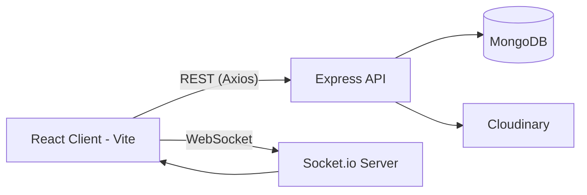

<div align="center">

# Job Portal

*A professional networking & social platform — connect, post, and engage in real time.*

**⚠️ Working title — see note below.** This repo is currently named `job-portal` on GitHub, but the codebase is a professional-networking / social-feed application (think a focused LinkedIn-style clone), not a job board. Rename the repo and update any resume references before sharing this link with recruiters, or the mismatch will cost you credibility the moment someone opens it.


</div>

---

## Overview

A full-stack social/professional-networking platform where users build a profile (headline, skills, education, experience), publish posts with optional images, and grow a network through send/accept connection requests. Likes, comments, and connection updates are delivered in real time via Socket.io, with a dedicated notification feed for each user.

**Stack:** React (Vite) on the frontend, Express + MongoDB on the backend, Cloudinary for image storage, Socket.io for real-time events, JWT (httpOnly cookie) for auth.

---

## Features

All items below are verified against the actual route/controller code — nothing here is assumed or aspirational.

#### Authentication
- Signup / login / logout
- Passwords hashed with bcrypt, minimum 8-character enforcement on signup
- JWT issued on login/signup, stored in an `httpOnly`, `sameSite=strict` cookie (secure flag enabled in production)

#### Profile
- View current user / view any user's profile by username
- Edit profile: name, username, headline, location, gender, skills, education, experience
- Profile photo and cover photo upload (stored via Cloudinary)

#### Social feed
- Create a post (text, with an optional image)
- View all posts, newest first
- Like / unlike a post (real-time broadcast to all connected clients)
- Comment on a post (real-time broadcast)

#### Connections
- Send a connection request
- Accept / reject a pending request
- Remove an existing connection
- Check connection status with a specific user
- List incoming pending requests
- List your current connections

#### Notifications
- Per-user notification feed (new like, new comment, connection accepted)
- Delete a single notification
- Clear all notifications

#### Discovery
- Search users by first name, last name, username, or skill
- "Suggested users" — users you're not already connected to

#### Real-time
- Socket.io used for live like/comment updates and live connection-status changes, mapped per logged-in user

---

## Tech Stack

| Layer | Technology |
|---|---|
| Frontend | React 19, Vite 6, React Router 7, Tailwind CSS 3, Axios, Socket.io-client, Moment.js, React Icons |
| Backend | Node.js, Express 4, Socket.io |
| Database | MongoDB with Mongoose 8 |
| Auth | JSON Web Tokens (`jsonwebtoken`), `bcryptjs` for password hashing |
| Media storage | Cloudinary |
| File handling | Multer (temp local storage before Cloudinary upload) |

---

## Architecture



The API server and the Socket.io server run on the same Node process (`backend/index.js`), sharing a single HTTP server instance. A simple in-memory map (`userSocketMap`) tracks which socket belongs to which logged-in user, used to target real-time events.

---

## Folder Structure

```
job-portal/
├── backend/
│   ├── config/
│   │   ├── db.js               # MongoDB connection
│   │   ├── token.js            # JWT signing
│   │   └── cloudinary.js       # Image upload helper
│   ├── controllers/
│   │   ├── auth.controllers.js
│   │   ├── user.controllers.js
│   │   ├── post.Controllers.js
│   │   ├── connection.controllers.js
│   │   └── notification.controllers.js
│   ├── middlewares/
│   │   ├── isAuth.js           # JWT verification middleware
│   │   └── multer.js           # File upload handling
│   ├── models/
│   │   ├── user.model.js
│   │   ├── post.model.js
│   │   ├── connection.model.js
│   │   └── notification.model.js
│   ├── routes/
│   │   ├── auth.routes.js
│   │   ├── user.routes.js
│   │   ├── post.routes.js
│   │   ├── connection.routes.js
│   │   └── notification.routes.js
│   └── index.js                # App entry point, Express + Socket.io setup
└── frontend/
    └── src/
        ├── pages/
        │   ├── Login.jsx
        │   ├── Signup.jsx
        │   ├── Home.jsx
        │   ├── Network.jsx
        │   ├── Notification.jsx
        │   └── Profile.jsx
        ├── components/
        │   ├── Nav.jsx
        │   ├── Post.jsx
        │   ├── EditProfile.jsx
        │   └── ConnectionButton.jsx
        └── context/
            ├── AuthContext.jsx
            └── UserContext.jsx
```

> **Note:** Controller and model filenames use lowercase prefixes (`post.Controllers.js`, `post.model.js`), but some imports reference them with a capital first letter (`Post.Controllers.js`, `Post.model.js`). This works on case-insensitive filesystems (Windows/macOS) but **fails on case-sensitive ones (Linux)** — which is what virtually every hosting platform runs on. Fix the import casing before deploying.

---

## Installation

```bash
git clone https://github.com/anshsuyal/job-portal.git
cd job-portal
```

**Backend**
```bash
cd backend
npm install
# Create a .env file (see Environment Variables below) — do NOT commit it
npm run dev
```

**Frontend**
```bash
cd frontend
npm install
npm run dev
```

The backend defaults to `PORT=5000` (overridable via `.env`); the frontend dev server runs via Vite (default `5173`). Update the hardcoded `serverUrl` in `frontend/src/context/AuthContext.jsx` and the CORS origin in `backend/index.js` if you change ports or deploy.

---

## Environment Variables

Create `backend/.env` with the following (never commit this file):

| Variable | Purpose |
|---|---|
| `PORT` | Port the Express server listens on |
| `MONGODB_URL` | MongoDB connection string |
| `JWT_SECRET` | Secret used to sign/verify JWTs |
| `NODE_ENVIRONMENT` | Set to `production` to enable secure cookies |
| `CLOUDINARY_CLOUD_NAME` | Cloudinary account name |
| `CLOUDINARY_CLOUD_API_KEY` | Cloudinary API key |
| `CLOUDINARY_CLOUD_API_SECERT` | Cloudinary API secret |

---

## API Reference

#### Auth — `/api/auth`
| Method | Endpoint | Auth | Body |
|---|---|---|---|
| POST | `/signup` | No | `firstName, lastName, userName, email, password` |
| POST | `/login` | No | `email, password` |
| GET | `/logout` | No | — |

#### User — `/api/user`
| Method | Endpoint | Auth | Notes |
|---|---|---|---|
| GET | `/currentuser` | Yes | Returns logged-in user (password excluded) |
| PUT | `/updateprofile` | Yes | Multipart form: `profileImage`, `coverImage`, profile fields |
| GET | `/profile/:userName` | Yes | Public profile lookup by username |
| GET | `/search?query=` | Yes | Search by name / username / skill |
| GET | `/suggestedusers` | Yes | Users excluding existing connections |

#### Posts — `/api/post`
| Method | Endpoint | Auth | Notes |
|---|---|---|---|
| POST | `/create` | Yes | Multipart: optional `image`, `description` |
| GET | `/getpost` | Yes | All posts, newest first |
| GET | `/like/:id` | Yes | Toggles like, emits `likeUpdated` |
| POST | `/comment/:id` | Yes | Body: `content`; emits `commentAdded` |

#### Connections — `/api/connection`
| Method | Endpoint | Auth | Notes |
|---|---|---|---|
| POST | `/send/:id` | Yes | Send a connection request |
| PUT | `/accept/:connectionId` | Yes | Accept a pending request |
| PUT | `/reject/:connectionId` | Yes | Reject a pending request |
| DELETE | `/remove/:userId` | Yes | Remove an existing connection |
| GET | `/getstatus/:userId` | Yes | Returns relationship status |
| GET | `/requests` | Yes | List incoming pending requests |
| GET | `/` | Yes | List current connections |

#### Notifications — `/api/notification`
| Method | Endpoint | Auth | Notes |
|---|---|---|---|
| GET | `/get` | Yes | All notifications for current user |
| DELETE | `/deleteone/:id` | Yes | Delete one notification |
| DELETE | `/` | Yes | Clear all notifications |

All `Yes`-auth routes require a valid `token` cookie, verified by the `isAuth` middleware.

---

## Authentication Flow

1. On signup/login, the server hashes (signup) or compares (login) the password with bcrypt.
2. A JWT containing the user ID is signed (`config/token.js`) and set as an `httpOnly` cookie, expiring in 7 days.
3. Protected routes run the `isAuth` middleware, which verifies the JWT from the cookie and attaches `userId` to the request.
4. Logout simply clears the cookie — there's no server-side token blocklist, so a token remains technically valid until it expires even after logout.

---

## Database Design

- **User** — profile fields (name, headline, skills, education, experience) plus a `connection` array of User references.
- **Post** — `author` (User ref), `description`, optional `image`, `like` (array of User refs), embedded `comment` subdocuments (`content` + `user` ref).
- **Connection** — `sender`, `receiver` (User refs), `status` enum (`pending` / `accepted` / `rejected`).
- **Notification** — `receiver`, `relatedUser`, optional `relatedPost`, `type` enum (`like` / `comment` / `connectionAccepted`).

---

## Security Features Implemented

- Passwords hashed with bcrypt (cost factor 10), never stored in plaintext
- JWT-based auth in an `httpOnly` cookie (not exposed to client-side JS)
- `sameSite: strict` cookie policy, with `secure` enabled when `NODE_ENVIRONMENT=production`
- Sensitive fields (password) excluded from API responses via `.select("-password")`
- Secrets loaded from environment variables (not hardcoded) — see the note at the top of this README about keeping `.env` out of version control

---

## Known Limitations / Roadmap

- No server-side input validation library (e.g. Zod/Joi) — fields are trusted as-is beyond basic existence checks
- No rate limiting on auth endpoints
- No automated tests (unit, integration, or E2E)
- Not currently deployed — frontend/backend URLs and CORS origin are hardcoded to `localhost`
- No CI/CD pipeline
- TypeScript migration, Dockerization, and a logout token-blocklist (e.g. via Redis) are reasonable next steps if this project gets actively maintained further

---

## Author

**Ansh Suyal**
GitHub: [@anshsuyal](https://github.com/anshsuyal)

---
